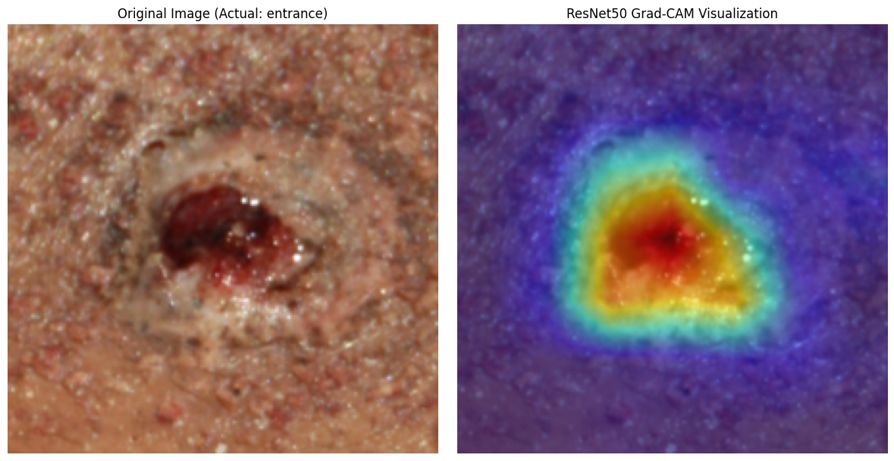
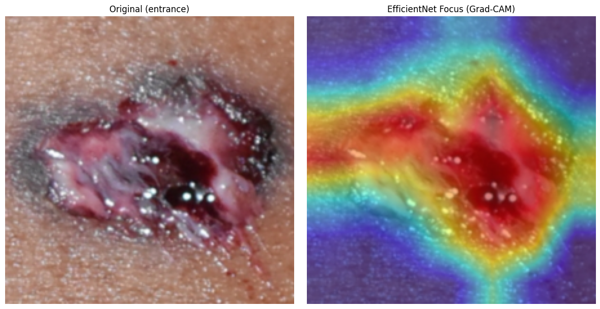
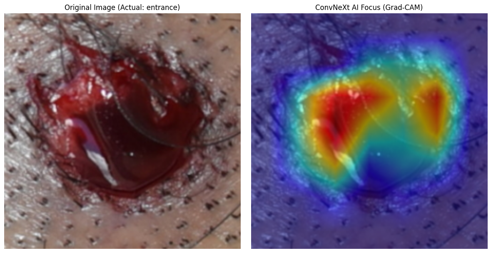
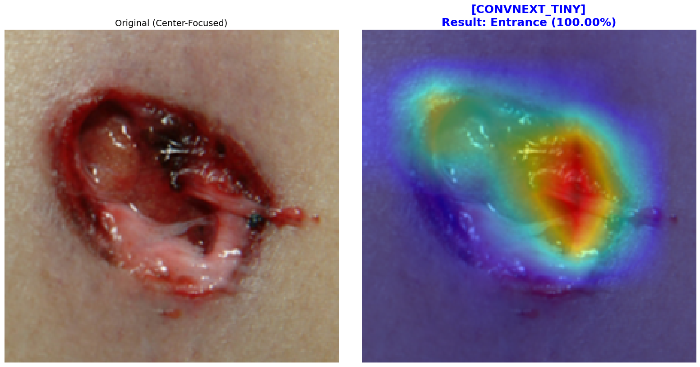

# 🩸 Forensic Gunshot Wound Classification: A Multi-Model CNN Benchmark

## 🩺 1. Problem Definition & Objectives
Distinguishing between **Entrance** and **Exit** gunshot wounds is a fundamental yet complex task in forensic pathology, essential for reconstructing shooting distances and trajectories. This project aims to develop a high-precision deep learning pipeline to assist forensic pathologists in identifying these wounds objectively.

By benchmarking **ResNet50**, **EfficientNet-B0**, and **ConvNeXt-Tiny**, this study identifies the optimal architecture for capturing subtle morphological markers—such as abrasion collars and radial skin tears—providing a robust "second-opinion" tool for forensic documentation.

## 📊 2. Dataset Specifications
The model was trained and evaluated using the **FDCPUnBGunshotDB**, a specialized forensic dataset provided by the University of Brasília.

* **Dataset Source:** [FDCPUnBGunshotDB GitHub](https://github.com/pedrogarciafreitas/FDCPUnBGunshotDB)
* **Classes & Distribution:**
  - **Entrance Wounds:** 1,883 images (Class 0)
  - **Exit Wounds:** 671 images (Class 1)
* **Forensic-Centric Preprocessing:** - **Center-Focus Strategy:** Implemented a **CenterCrop (224x224)** approach to focus strictly on the wound's central morphology.
  - **Imbalance Handling:** Utilized **Weighted Cross-Entropy Loss** (Ratio 1:2.8) to ensure high sensitivity for the minority class (Exit wounds).

## 🚀 3. Key Technical Features
* **Automated Data Pipeline:** Custom **`preprocess.py`** script with a **GUI** to efficiently organize and label raw forensic data from diverse sources.
* **Multi-Model Benchmarking:** Comparative study of three state-of-the-art CNNs using transfer learning.
* **Explainable AI (XAI):** Integrated **Grad-CAM** to verify that the models prioritize clinically relevant features (e.g., marginal abrasion) rather than background artifacts.
* **Hardware:** Optimized for training on **Google Colab L4 GPU** environments.

## 📈 4. Performance Metrics (Benchmark Results)
The **ConvNeXt-Tiny** model achieved superior performance, demonstrating high reliability for forensic application with an accuracy of **91.9%**.

| Model | Accuracy | Entrance F1-Score | Exit F1-Score |
| :--- | :---: | :---: | :---: |
| ResNet50 | 87% | 0.91 | 0.75 |
| EfficientNet-B0 | 84% | 0.89 | 0.70 |
| **ConvNeXt-Tiny** | **91.9%** | **0.95** | **0.84** |

---

## 🔍 Visual Analysis Comparison

### A. Confusion Matrix (CM) Results
The following matrices illustrate the classification performance. ConvNeXt-Tiny shows the highest reliability in correctly identifying Exit wounds.

#### 1. ResNet50 Confusion Matrix

#### 2. EfficientNet-B0 Confusion Matrix

#### 3. ConvNeXt-Tiny Confusion Matrix (Best)

---

### B. Model Interpretability (Grad-CAM)
We verified the models' focus using Grad-CAM. Successful cases show concentrated attention on the **wound margin** and **skin tearing patterns**.

#### 1. ResNet50 Focus Analysis

#### 2. EfficientNet-B0 Focus Analysis

#### 3. ConvNeXt-Tiny Focus Analysis (Superior Robustness)

---

## 🔍 Interactive Forensic Inference Tool
I have included an **Interactive Inference UI** at the end of the notebook. Users can select a model and upload custom gunshot images to receive real-time classification and Grad-CAM visualization.

### Interactive UI Example

> **Reference:** *“Artificial intelligence for human gunshot wound classification”*, **Journal of Pathology Informatics (2024)**. This project enhances those methodologies with modern SOTA architectures and forensic-centric cropping.

---

## 🧑‍⚕️ About the Author
**Hee Jae Ryu (HEE JAE RYU), MD**
* **Pathology Residency Applicant (2026 Match)**
* **MD, Chungbuk National University College of Medicine**
* **Content Creator at 'CowEye' (1.68M+ Subscribers)**
* **Primary Interests:** Digital Pathology, Forensic Science, and AI-driven Diagnostics
