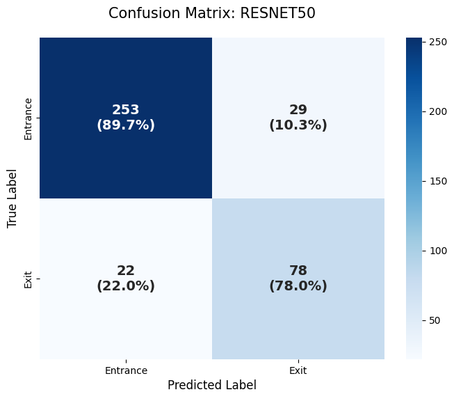
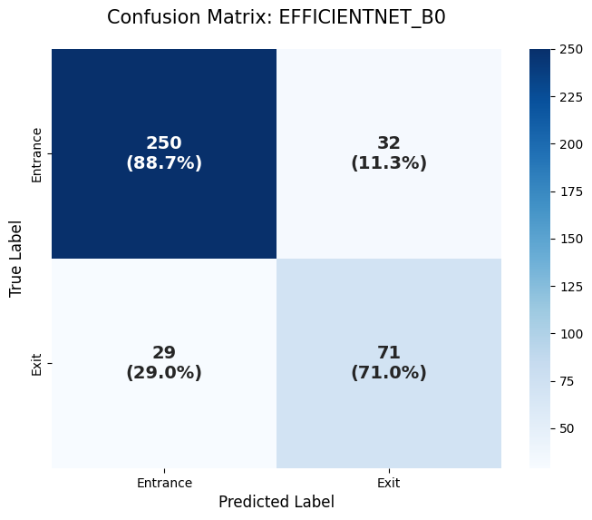
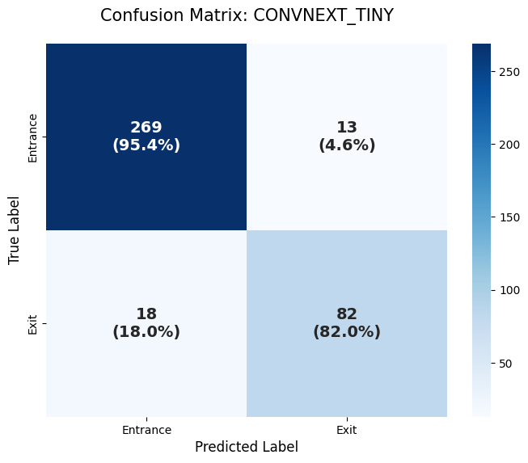

# 🩸 Forensic Gunshot Wound Classification using Deep Learning

This project implements a deep learning pipeline to classify **Gunshot Entrance vs. Exit wounds**, a critical task in forensic pathology. We benchmarked three state-of-the-art architectures and utilized **Grad-CAM** to ensure the model focuses on medically relevant features rather than background artifacts.

## 🚀 Key Features
- **Multi-Model Benchmarking:** Comparison between ResNet50, EfficientNet-B0, and ConvNeXt-Tiny.
- **Forensic-Centric Preprocessing:** Applied **Center-Focus Cropping** (224x224) to mimic a pathologist's concentrated observation of the wound area.
- **Class Imbalance Handling:** Implemented **Weighted Cross-Entropy Loss** to improve detection sensitivity for Exit wounds (minority class).
- **Explainable AI (XAI):** Integrated **Grad-CAM** visualization to verify that the model prioritizes morphological features like the abrasion collar and skin tearing.

## 📊 Performance Results
The **ConvNeXt-Tiny** model achieved the highest overall accuracy and demonstrated superior reliability in distinguishing complex wound patterns.

| Model | Accuracy | Entrance F1-Score | Exit F1-Score |
| :--- | :---: | :---: | :---: |
| ResNet50 | 87% | 0.91 | 0.75 |
| EfficientNet-B0 | 84% | 0.89 | 0.70 |
| **ConvNeXt-Tiny** | **92%** | **0.95** | **0.84** |

### Confusion Matrices
The following matrices illustrate the classification performance across all three models. ConvNeXt-Tiny shows a significant reduction in false negatives for Exit wounds.

| ResNet50 | EfficientNet-B0 | ConvNeXt-Tiny (Best) |
| :---: | :---: | :---: |
|  |  |  |

## 🔍 Visual Analysis (Grad-CAM)
We used Grad-CAM to validate the model's decision-making process. 
- **Successful Case:** The model correctly identifies the **marginal abrasion** and **soot patterns** (if present) for Entrance wounds.
- **Robustness:** ConvNeXt-Tiny showed the highest resilience against background noise such as medical rulers or grid-patterned scales.

*(Tip: Upload your best Grad-CAM image to the outputs folder and link it here)*

## 🛠️ Tech Stack
- **Framework:** PyTorch, Timm (PyTorch Image Models)
- **Visualization:** Grad-CAM (pytorch-grad-cam), Matplotlib, Seaborn
- **Environment:** Google Colab (L4 GPU)
- **Metrics:** Scikit-learn (Confusion Matrix, Classification Report)

## ⚖️ Disclaimer
This project is for academic and research purposes only. It is intended to assist forensic professionals and should not be used as a standalone diagnostic tool in legal or clinical settings.
